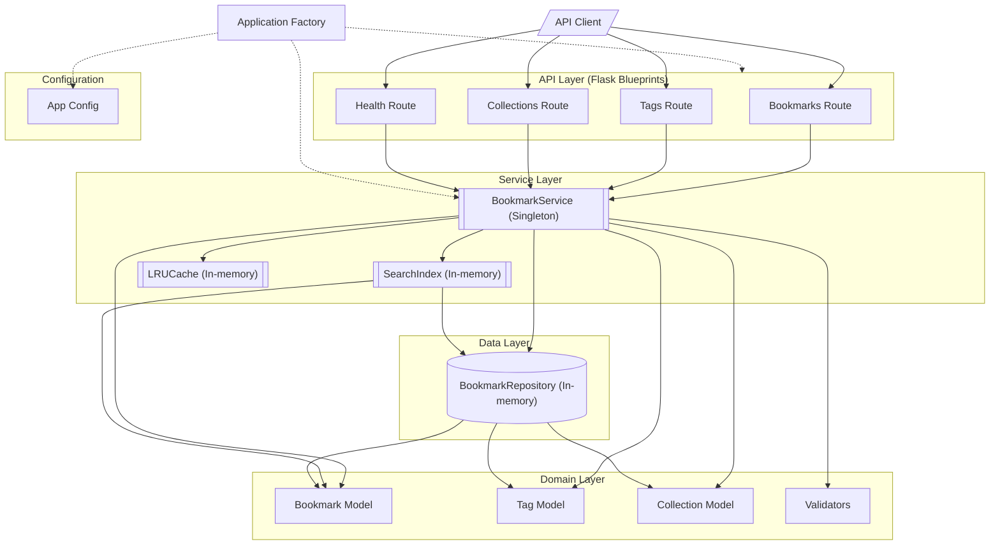

# Component Architecture of the Pagemark Flask API

This component architecture diagram illustrates the layered structure of the Pagemark Flask API. 

The application follows a classic layered architecture:
1.  **API Layer**: Composed of Flask Blueprints (`app.routes`) that handle HTTP requests and responses. These routes delegate all business logic to the `BookmarkService`.
2.  **Service Layer**: The core of the application. `BookmarkService` acts as a singleton facade that orchestrates operations across the repository, search index, and cache. It also handles data validation using internal helpers.
3.  **Data Layer**: Features an in-memory `BookmarkRepository` that provides a clean abstraction for data access, isolating the service layer from storage details.
4.  **Domain Layer**: Contains the core entities (`Bookmark`, `Tag`, `Collection`) and their associated business rules and validators.

The diagram highlights the central role of the [BookmarkService](/api_ref/app/services/bookmark/service/bookmarkservice) as the primary orchestrator, and the use of specialized internal services like [SearchIndex](/api_ref/app/services/search/service/searchindex) for full-text search and LRUCache for performance optimization. All data is currently managed in-memory via the [BookmarkRepository](/api_ref/app/db/repository/bookmarkrepository).

**Key Architectural Findings:**
- The application uses a singleton `BookmarkService` as a central facade for all business logic.
- Routes are organized into Flask Blueprints (bookmarks, tags, collections, health) that all depend on the `BookmarkService`.
- Data persistence is abstracted through a `BookmarkRepository`, which currently implements an in-memory store.
- A custom `SearchIndex` provides full-text search capabilities by indexing bookmark titles and descriptions in-memory.
- An internal `LRUCache` is used by the `BookmarkService` to speed up bookmark retrieval by ID.
- The `app.config` module provides environment-specific settings (Development, Production, Testing) used during application factory initialization.

