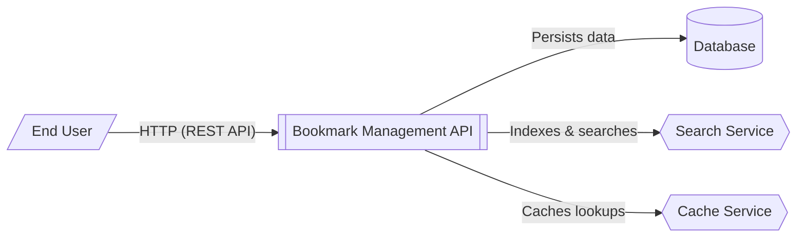

# System Context for Bookmark Management API

This system context diagram illustrates the Bookmark Management API and its interactions with users and external dependencies. The API serves as a central hub for managing bookmarks, tags, and collections.

- **End Users** interact with the system through a RESTful API, performing operations such as creating, updating, and searching for bookmarks.
- The **Bookmark Management API** (built with Flask) orchestrates business logic, validation, and coordination between storage and search components.
- The **Database** (currently stubbed for PostgreSQL) provides persistent storage for domain entities like bookmarks, tags, and collections.
- The **Search Service** (implemented as an in-memory inverted index) provides full-text search capabilities, designed to be replaced by external services like Elasticsearch or Typesense in production.
- The **Cache Service** (implemented as an in-memory LRU cache) improves performance by reducing redundant database lookups for frequently accessed bookmarks.

The architecture follows a layered pattern where the service layer ([BookmarkService](/api_ref/app/services/bookmark/service/bookmarkservice)) abstracts the underlying storage and search implementations from the API routes.

**Key Architectural Findings:**
- The system is a Flask-based REST API with a layered architecture (Routes -> Services -> Repositories).
- It features a dedicated search service using an inverted index for full-text search across bookmark titles and descriptions.
- An internal LRU cache is used to optimize bookmark retrieval performance.
- The database layer is abstracted via a repository pattern, with a connection pool stubbed for PostgreSQL (port 5432).
- Configuration is managed through environment-specific classes (Development, Production, Testing) using `os.environ`.

