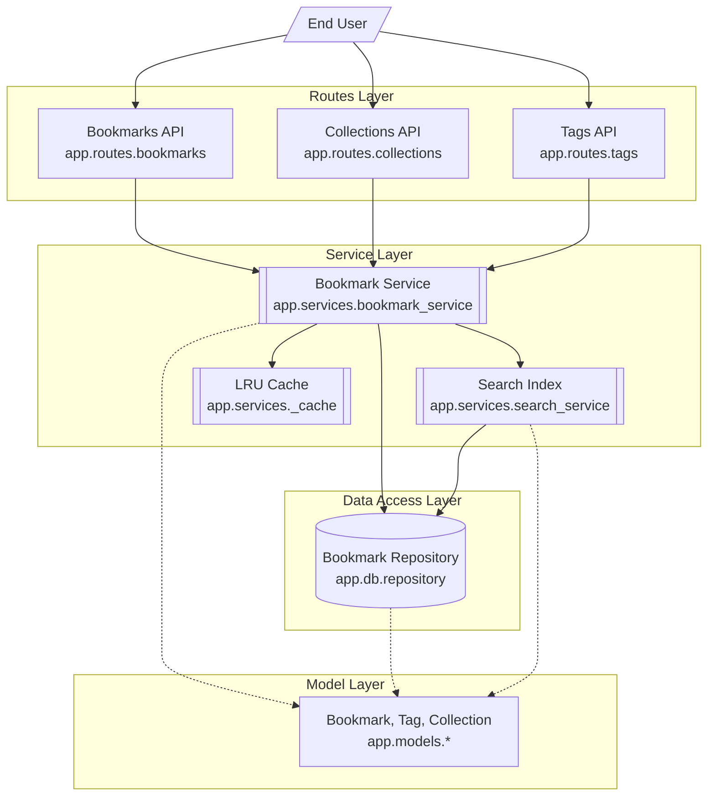

# Bookmark API Component Architecture

The Bookmark API follows a classic layered architecture for a Flask-based REST service. 

At the top level, the **Routes Layer** (blueprints) handles incoming HTTP requests and delegates all business logic to the [app.services.bookmark_service](/api_ref/app/bookmark_service). This service acts as a **Facade**, orchestrating interactions between the data storage, search indexing, and caching mechanisms.

The [app.services.bookmark_service](/api_ref/app/bookmark_service) is implemented as a singleton to ensure consistent state across different route modules. It manages:
- **Data Persistence**: Via the [app.db.repository](/api_ref/app/repository), which provides an in-memory abstraction for storing [Bookmark](/api_ref/app/models/bookmark/bookmark), tags, and collections.
- **Search**: Via the [app.services.search_service](/api_ref/app/search_service), which maintains an inverted index of bookmark content for fast full-text retrieval.
- **Performance**: Via an internal [Service Architecture and Caching](/guides/bookmark-operations/service-architecture-and-caching) (LRU implementation) that reduces repository lookups for frequently accessed bookmarks.

The **Model Layer** defines the core domain entities ([Bookmark](/api_ref/app/models/bookmark/bookmark), `Tag`, `Collection`) which are used across all layers of the application for data transfer and validation.

**Key Architectural Findings:**
- The application uses a Singleton pattern for the BookmarkService to maintain a shared state across Flask blueprints.
- The BookmarkRepository provides an in-memory storage abstraction, decoupling the service layer from the actual storage implementation.
- Search functionality is implemented as a separate SearchIndex component that rebuilds itself from the repository on startup.
- An internal LRU Cache is used within the service layer to optimize bookmark retrieval.
- The architecture strictly follows a layered approach where routes never touch the repository directly, always going through the service layer.

