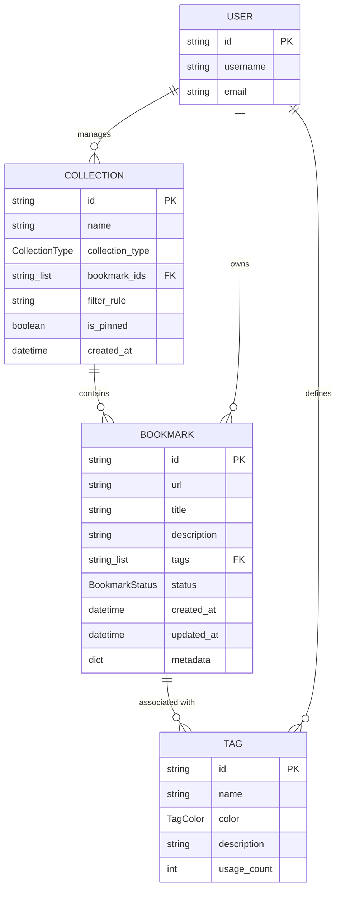

# Bookmark Domain Data Model

The data model for the Pagemark API is centered around three primary domain entities: [Bookmark](/api_ref/app/models/bookmark/bookmark), [Tag](/api_ref/app/models/tag/tag), and [Collection](/api_ref/app/models/collection/collection). 

- **Bookmark**: The core entity representing a saved URL. It contains metadata such as title, description, and status (Active, Archived, Trashed). It maintains a list of associated Tag IDs.
- **Tag**: A label used to organize bookmarks. It includes a name, color, and a usage count. While the code mentions that tag names should be unique per user, a formal `User` entity is not yet implemented in the current codebase.
- **Collection**: A grouping mechanism for bookmarks. Collections can be **manual** (where bookmarks are explicitly added) or **smart** (where bookmarks are automatically included based on a filter rule). It maintains an ordered list of Bookmark IDs.

The relationships are implemented using identifier lists (foreign keys) within the dataclasses, representing many-to-many associations between Bookmarks and Tags, and between Collections and Bookmarks.

**Key Architectural Findings:**
- The system uses Python dataclasses for domain models with in-memory storage.
- Relationships are managed through lists of IDs (e.g., `Bookmark.tags` and `Collection.bookmark_ids`) rather than direct object references.
- Enums are used for state management: `BookmarkStatus`, `TagColor`, and `CollectionType`.
- A 'User' entity is mentioned in comments and README but is not currently implemented as a class or database entity.
- Smart Collections use a `filter_rule` string to dynamically associate with bookmarks based on content matching.

