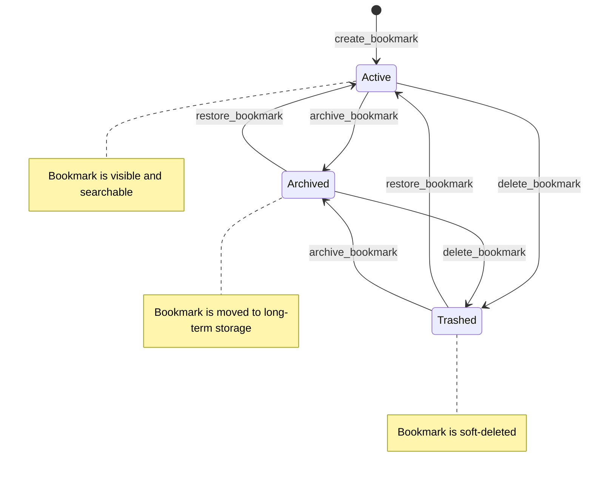

# Bookmark Lifecycle States

This state machine diagram illustrates the lifecycle of a [Bookmark](/api_ref/app/models/bookmark/bookmark) entity within the system. 

The lifecycle begins when a bookmark is created via the `create_bookmark` service method, which initializes it in the **Active** state. From there, the bookmark can transition between three primary states: **Active**, **Archived**, and **Trashed**.

Key transitions are triggered by specific service operations:
- **Archive**: Triggered by `archive_bookmark`, moving the bookmark to the **Archived** state from either **Active** or **Trashed**.
- **Trash**: Triggered by `delete_bookmark`, which performs a soft-delete by moving the bookmark to the **Trashed** state.
- **Restore**: Triggered by `restore_bookmark`, which returns a bookmark from **Archived** or **Trashed** back to the **Active** state.

The system uses an in-memory repository where these state changes are persisted. Notably, the current implementation allows transitions between any of these states without restrictive guard conditions, meaning a bookmark can be moved directly from **Trashed** to **Archived** or vice versa. There is currently no terminal "Deleted" state exposed via the public API, as the `delete` operation is implemented as a soft-delete (trashing).

**Key Architectural Findings:**
- Bookmarks are initialized in the 'active' status upon creation.
- The 'delete' operation is a soft-delete that transitions the bookmark to the 'trashed' status.
- The 'restore' operation transitions a bookmark from 'archived' or 'trashed' back to 'active'.
- Transitions are permissive; for example, a bookmark can move directly from 'trashed' to 'archived'.
- There is no hard-delete transition exposed in the service layer, although the repository supports it.

