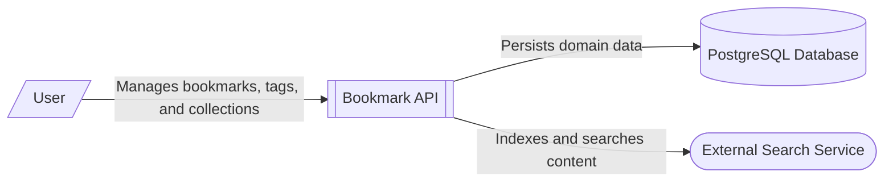

# Bookmark Management System Context

The Bookmark Management System is a backend web service that provides a RESTful API for organizing web links. It allows users to create, update, and categorize bookmarks using tags and collections.

The system is built with the Flask framework and follows a layered architecture. The [Bookmark API Component Architecture](/architecture/architecture-overview/bookmark-api-component-architecture) acts as the central hub, orchestrating requests from users and delegating business logic to internal services.

Key external integrations include:
- **PostgreSQL Database**: Used for persistent storage of domain entities such as bookmarks, tags, and collections. The codebase includes a connection pool and repository layer designed for a relational database.
- **External Search Service**: Provides full-text search capabilities. While the current implementation uses an in-memory inverted index, the architecture is designed to integrate with external search engines like Typesense or Elasticsearch for production scalability.
- **End Users**: Interact with the system via standard HTTP methods (GET, POST, PUT, DELETE) to manage their bookmark library.

Internally, the system also employs an LRU (Least Recently Used) cache to improve performance for frequently accessed bookmarks, reducing the load on the underlying storage.

**Key Architectural Findings:**
- The system is a Flask-based REST API for managing bookmarks, tags, and collections.
- It uses a Repository pattern to abstract data access, with infrastructure in place for a PostgreSQL database.
- A dedicated Search Service provides full-text search, designed to be replaced by external engines like Elasticsearch in production.
- The API includes an internal LRU cache to optimize bookmark retrieval performance.
- The system is designed as a pure backend service, intended to be consumed by web, mobile, or browser extension clients.

